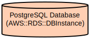

# PrepIfy - AI-Powered Interview Preparation Platform

PrepIfy is an intelligent interview preparation platform that leverages AI to provide personalized interview practice sessions. The platform helps candidates prepare for both technical and behavioral interviews by generating relevant questions, providing real-time feedback, and tracking progress. Also provides a community section where users can share their interview experience with others.
And will be Dockerized in the near future.

The application uses Next.js for the frontend, PostgreSQL for data storage, and integrates with Google's Generative AI for question generation and answer evaluation. It features a secure authentication system with Next-Auth, real-time feedback mechanisms, and a user-friendly interface for managing interview sessions.

## 🚧 Under Development

This project is currently a work in progress and not yet ready for production use.

I'm actively working on building and testing features, and things may break or change frequently.  
Feel free to explore the code, give feedback, or contribute, but please note that this is **not yet stable**.

Stay tuned for updates!

## Repository 

```

.
├── src/                          # Source code directory
│   ├── app/                     # Next.js application routes and pages
│   │   ├── (Home)/             # Home-related pages and layouts
│   │   ├── api/                # API routes for authentication and interview sessions
│   │   └── components/         # Reusable UI components
│   ├── lib/                    # Utility functions and configurations
│   │   ├── auth.ts            # Authentication configuration
│   │   ├── prisma.ts          # Database client configuration
│   │   └── utils.ts           # Helper utilities
├── prisma/                     # Database schema and migrations
│   └── migrations/            # Database migration files
├── public/                     # Static assets
└── components.json            # UI component configuration
```

## Usage Instructions

### Prerequisites

- Node.js 16.x or later
- PostgreSQL 12.x or later
- npm or yarn package manager
- Google Cloud API key (for AI features)

### Installation

```bash
# Clone the repository
git clone <repository-url>
cd prepify

# Install dependencies
npm install

# Set up environment variables
cp .env.example .env
# Edit .env with your database and API credentials

# Run database migrations
npx prisma migrate dev

# Start development server
npm run dev
```

### Quick Start

1. Register an account or log in to an existing account
2. Navigate to the interview preparation section
3. Select your target position and interview type
4. Start the interview session

### More Detailed Examples

```typescript
// Starting a new interview session
const startSession = async () => {
  const response = await fetch('/api/start-interview-session', {
    method: 'POST',
    body: JSON.stringify({
      position: 'Software Engineer',
      type: 'technical',
      level: 'senior'
    })
  });
  const session = await response.json();
};
```

### Troubleshooting

- **Authentication Issues**
  - Error: "Unauthorized"
  - Solution: Ensure you're logged in and your session hasn't expired
  - Check browser console for detailed error messages

- **Database Connection Issues**
  - Error: "Could not connect to database"
  - Solution: Verify PostgreSQL is running and credentials are correct
  - Check DATABASE_URL in .env file

## Data Flow

PrepIfy follows a structured flow for managing interview sessions and user interactions.

```ascii
User -> Authentication -> Interview Session -> AI Question Generation -> User Response -> AI Evaluation -> Feedback
```

- **Key component interactions:**

1. User authentication through NextAuth.js
2. Session management using Prisma ORM
3. AI integration through Google GenAI APIs
4. Real-time feedback processing
5. Database persistence for session history

## Infrastructure


The application uses a PostgreSQL database with the following key resources:

**Database Tables:**

- User: Stores user authentication and profile information
- InterviewSession: Manages interview sessions and their states
- Questions: Stores generated questions
- Technoloies: Stores technology stack information
- Responses: Stores AI feedback and score

**Authentication:**

- NextAuth.js for user authentication
- Credentials provider for email/password authentication
- Session management using JWT tokens
- Secure password hashing with bcrypt
